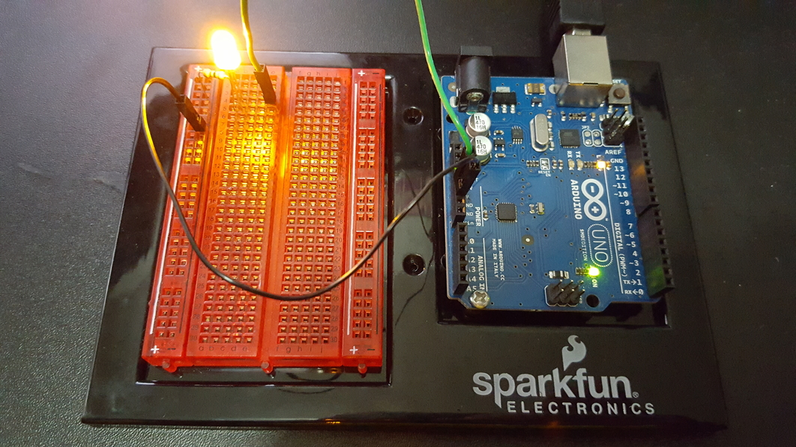

<!--https://learn.sparkfun.com/tutorials/voltage-current-resistance-and-ohms-law-->

# Entry 1: Understanding basics of a circuit

## What is arduino?
Arduino is an open source platform that utilizes both a circuit board and software to build electronics. 
To put this into simplier terms, it allows us to program the board to control gadgets like 
LEDs, motors, sensors, and much more! 
Not only is it a great tool to create new projects, 
but also a useful tool for programmers to bridge the their knowledge gap between software and hardware. 

## Electricity

In order to build something cool with arduino, it is imperative to achieve a basic understanding of electricity.
As we all know, electricity is the flow of electrons. The 3 basic principles of electricity are voltage, current, and resistance. 
These variables can be measured 
* Voltage, also known as potential difference, is difference in charge between 2 points (measured in volts)
* Current is the rate at which electricity flow (measured in amps)
* Resistance is the tendency to impede the flow of electricity (measured in ohms)           
 
The relationship between the 3 variables are defined as such:
**I = V/R**, where **I** is current, **V** is voltage, and **R** is resistance.
As voltage increases and resistance decreases, the current increases. 
In order to deliver the most amount of electricity, 
both the current and the voltage has to be high while the resistance remains low.

## The arduino board

#### 1. USB power/signal input
Through a USB type B conenction, the arduino board receives both a 5v power delivery and digital signals from another device.  

#### 2. Battery power input
A barrel jack input used only for power. 

#### 3. Digital pins (blue box)
Pins used for both input/output of digital signals. These pulse width modulation (PWM) signals can be controlled 
by the arduino software, therefore regulating the power output. 

#### 4. Analog pins (green box)
Input pins that receives signals from gadgets. This signals can be used as information to troubleshoot our electronics. 

#### 5. Power pins (red box)
Output pins that provide power with no PWM control. 

#### Ground ports (yellow box)
Have you ever wondered why pigeons don't get electrocuted when they stand on the utility pole wires?
The reason why pigeons don't get electrocuted is because they aren't grounded. You get it? Pigeons aren't GROUNDed because they're up in the sky. HAHA. 
Now back to electricity. As aforementioned, voltage is the difference in charge between 2 points.
In this case, the 2 points are the pigeon and the wire. 
Since electricity flows from high voltage to low voltage, 
the electricity, in this situation, will not flow because 
the voltage is the same and there is no difference in charge. 
**Every circuit must be grounded in order for electricity to flow.** 

## The circuit

#### Breadboard
A breadboard serves as highway for electricity to flow. Instead of using messy wires, a breadboard uses copper fins that connect to each other. 

The breadboard consists of 3 major sections. The **positive power rail**, the **negative power rail**, and the **terminal strips**.
#### 1. Positive power rail (red)
The electricity runs vertically in the positive power rail, along the entire red bar.

#### 2. Negative power rail (blue)
Similar to the positive power rail, the negative power rail also runs vertically. 

#### 3. Terminal strips 
The terminal strips run horizontally, from columns a to e. Each row runs individually. 
In other words, the electricity will not flow from row 1 to row 2 unless they're connected by a wire. 

This is an example of a complete circuit.

The black wire connects to the ground pin while the green wire connects to the 5v pin. 
As you have probably also noticed, there is tiny brown pill-like thing next to the LED. That is known as a **resistor**. 
It is necessary to have a resistor to reduce the current so that the LED won't pop.

## Takeaways

### 1. Learn how to walk before you run
The biggest takeaway for this first entry is probably the fact that you have to learn how to walk before you run. 
When I first got my arduino kit, I jumped straight into building. I had something like this. 

It didn't work the way I expected it to, which was no surprise as I had no knowledge of how a circuit works. 

### 2. Ask questions. Form a hypothesis. Test!

Learning doesn't end with finding the answer. In fact, it never ends. You can never ask too many questions. 
When I completed my first LED circuit, I was proud of myself. 
But then I began wondering what would happens if I switched the order of the LED? 
What would happen if I plugged this somewhere else?
By asking myself those questions, tinkering, and goolging, I learned 2 things. 

1. A LED is polarized. The anode (positive side with a longer leg) should be connected to the voltage pin 
and the cathode (negative side with a shorter leg) should be connected to the ground pin. Otherwise, the LED will not turn on.

2. A resistor is not polarized. The orientation in which you connect the resistor doesn't affect the circuit. 
Additionally, the order in which you place the resistor also doesn't matter. It could go either before or after the LED.

