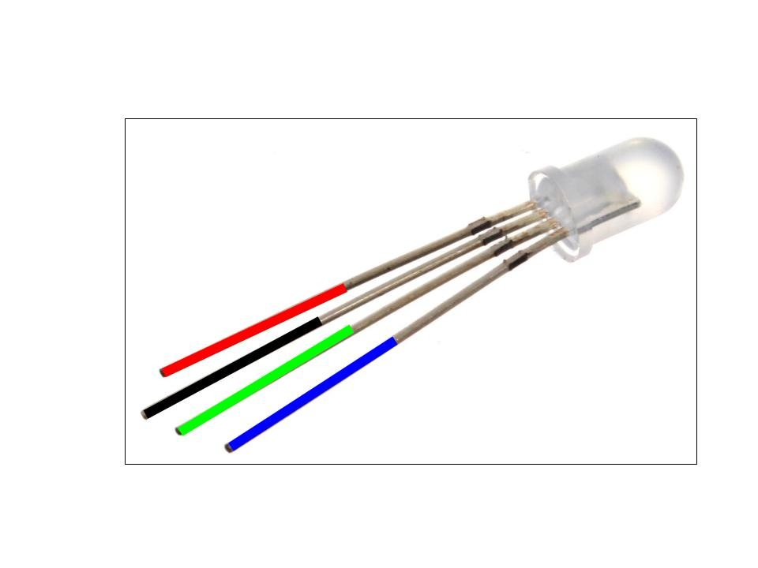
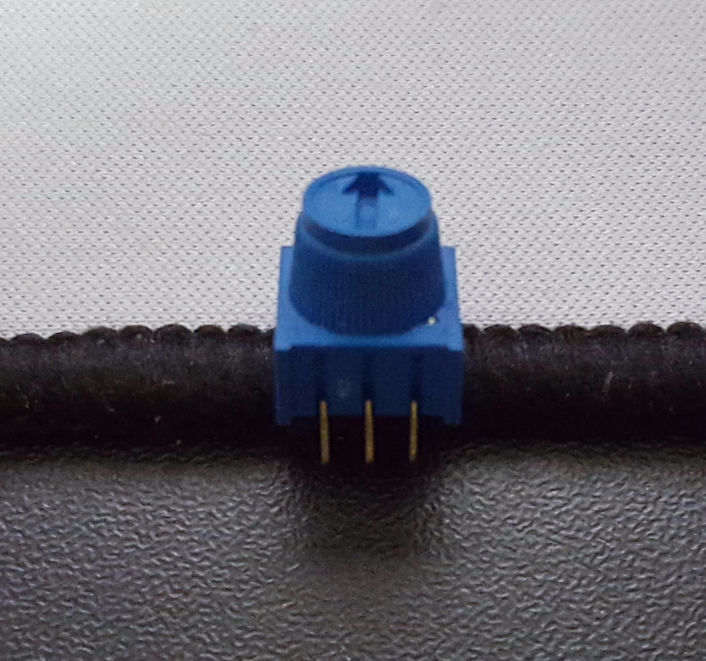

# Entry 2: Experimenting with the hardware and software

## Arduino software concepts

### Functions
Functions are sets of prewritten code that can be reused
simply by calling the function. They are useful for both returning data
and running code repeatedly in different parts of our code. 
While there are functions predefined in many programming languages, 
we can still define our own functions. 

### Void
Void is commonly used with the `setup()` and `loop()`.
Any code within `void setup()` only runs on the initialization of the program. 
On the other hand, any code within `void loop()` runs repeatedly until the program is terminated.
When a function is called with void, the function itself doesn't return data. 
Nevertheless, information can still be passed from inside the function to other parts of our program.
 
### Input/output
The arduino controller consists of both analog and digital signals.
It takes in both analog and digital signals, but only outputs digital signals.

The most common form of digital signal is an voltage output. The following code 
demonstrates how to create an voltage output:
```
void setup() {
    pinMode(pin#,OUTPUT); //disables the large current resistor and allows optimal current output
}

void loop(){
    digitalWrite(pin#,HIGH); //'high' defines the maximum voltage the board can output (5v for Arduino Uno)
}
```

An example usage of analog signals is to measure current input.
The `analogRead(pin#)` function takes an analog signal (voltage input) and returns a number from 0 to 1023. 

### Timing
It is very important to incorporate the `delay(milliseconds)` function into our arduino programs.
For one, it helps us control when a LED turns on or when a motor starts spinning. 
But also, it prevents our programs from crashing. 
Without a delay, a single line of code executes infinitely amount of times continuously. 
Thus, causing our program to crash.

## Basic LED
There are 4 different colors for the LEDs: red, blue, green, 
and yellow. Each LED has 2 polarities: the anode and the cathode.
The anode is the longer leg and the positive connection of the LED 
while the cathode is the shorter leg and the negative connection of the LED.
Every LED needs a resistor to limit the current. 

## RGB LED
The RGB LED is essentially a combination of all three basic LEDs 
sharing the same cathode. Each LED has its own anode, which makes
up for 3 of the pins. The last and longest pin is the cathode.



Similar to three basic LEDs, the RGB LED needs resistors.
In this case, each anode needs its own resistor. 

## Potentiometer

A potentiometer is used to regulate resistance. By turning the knob, 
you are either increasing or decreasing the current passing through the potentiometer. 



There are also 3 pins on a potentiometer. The middle pin is the output, 
which can be connected to the analog inputs on the arduino board. 
The pin left of the center pin is the ground pin. On the right is the power input. 
As the knob turns to the right, resistance decreases and the voltage increases. 


### Measuring the resistance with a potentiometer
1. Connect the output to one of the pins in the **ANALOG IN** sections. 
2. Inside void setup, choose a console port using this line of code: `Serial.begin(9600)`.
This starts up the serial at 9600 bits per second of data transfer speed.
3. Type `analogRead(pin#)` to begin monitoring the resistance outputted. 
Be sure to add a `delay(milliseconds)` to prevent the program from crashing.
The values returned should range from 0 (no voltage) to 1023 (max voltage), 
and will be visible in the serial monitor (located in the far right of the tool bar).


## Motor
The motor has 2 pins, an anode and a cathode. 
It is compatible with PWM control, but only its speed can be controlled. 

## Mini project: LED equalizer

Combining most of the things I have learned throughout week, I decided to make something simple.
I used the potentiometer as a controller for the LEDs. Since it returns a number between 0 to 1023, I used that 
number as a scale to control when the LEDs light up. As the number increases, more LEDs light up. 
At over 1000, all the LEDs will blink rapidly. 

<a href="https://circuits.io/circuits/4489902-led-equalizer">Link to my mini project</a>

## Project idea: Smart home

I have always wanted a smart home. After browsing through Amazon and various retailers, 
I realized that this comes with a hefty price tag. Just the Amazon Echo controller alone costs $180, 
not to mention the costs of other gadgets such as RGB lightbulbs, motion sensors, and smart locks. 
What you're really paying for is not the technology itself, but it knowledge within it. 
Why pay for someone else's knowledge when you can gain knowledge for yourself?
I believe that the best part to this project is learn the ideas behind technology that we take for granted.

#### Parts of the smarthome

1. RFID (Radio-frequency identification) lock
2. Automatic lighting control
3. Weather notifications

## Takeaway

#### Don't do something without a thorough plan.

This really comes from my project idea of a smart home. 
The first part of this project is to make a RFID door lock.
While the concept might be simple, the actual application requires a lot of precision.
The idea is to use a motor to push the lock open when a authorized id card is sensed by the RFID sensor.
There were, however, several issues that I came across.

1. I thought about using a regular motor to turn the lock, but realized that
the motor doesn't have enough torque to turn the lock.
So then I thought about using an electromagnetic solenoid to push the lock, 
which uses an electromagnetic field to rapidly eject a bolt.
Just when I thought this was the solution, I realized that the solenoid requires a lot of power (24v). 
After more research, I came across the servo, which is a motor with a much higher torque and allows precise rotations. 

2. The RFID sensor has to be in the inside unless I drill a hole in my door to route the cables (not a smart idea).
This caused a problem for me as most RFID sensors have poor sensing range. I have yet to find a solution to this issue.

The list goes on. Before I actually start this project, I have to make sure that everything is compatible.
I were to make this lock without considering all these factors, I would have wasted both my time and money.


