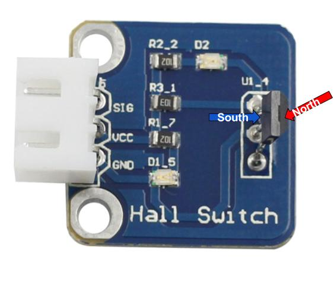
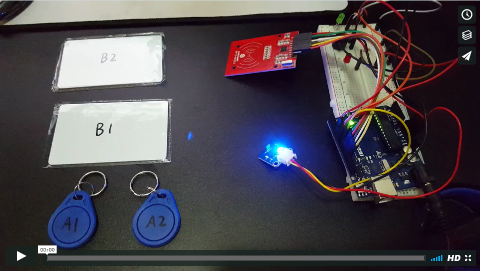

<!--http://mkme.org/forum/viewtopic.php?f=2&t=38-->

# Starting my project

## Piezo buzzer
The piezo buzzer is a mini speaker that is fairly easily to use. 
It has an anode that takes in 5v and a cathode that connected to the ground.
The piezo buzzer is controlled using this simple line of code: 
`tone(input_pin,frequency,duration*)`. The `tone()` function has 3 parameters. 
1. `input_pin` is where the anode is connected to. 
2. `frequency` can range from 31 Hertz all the way up to 65,535 Hertz.
As the frequency increases, the tone becomes higher pitched. 
3. `duration` (measured in milliseconds), is an optional parameter. 
If no duration is specified, the tone will be on infinitely. 

## Hall effect sensor

A hall sensor detects the presence of a magnet. This will be particularly useful in my project as it will notify my program 
when the door is closed. The servo will only turn the lock once the door has been closed. 
It uses a 3 pin connection. The first 2 pins are 5v and ground, while the last pin is a digital signal pin. 
When a magnet is near the sensor, it interrupts the current flowing through the switch and 
the function `digitalRead(hall_sensor_pin)` will read `LOW` or `0`. 
While I was experimenting with the sensor, I discovered that the sensor is actually polarized. 



With that being said, the sensor will not work properly unless opposite polarities face each other.

## Mifare rfid module
This is the core to my rfid door lock. It consists of 2 parts, the key and the sensor. 
Inside the key, there is a chip and an antenna. The antenna are copper wires that 
generate a magnetic field around the key so that the chip can send and receive data from the sensor. 
As the key approaches the sensor, the unique identification (uid) stored on the chip is read.

### Connections
For arduino, there are 2 main communication protocols. Both protocols utilize primary and secondary devices, 
where the primary device is essentially the controller device that initiates the communication.
A primary device is also commonly referred to as a **master** while a secondary device as a **slave**.
Below are some key differences between the 2 protocols.

1. **Serial peripheral interface (SPI)**

    + only allows one primary (controller) device
    + allows multiple secondary devices receiving and sending information
    + requires 7 pins in total (5 for communication and 2 more for power) 

    Pins on a SPI device:
    
    + SDA/NSS (Serial Data Line): sends data through the serial bus
    + MOSI (Master Out Slave In): primary device sending data and secondary device receiving data
    + MISO (Master In Slave Out): secondary device sending data and primary device receiving data
    + SCK/SCL (Serial Clock): synchronizes communications between the primary and secondary device(s)
    + RST (reset): restarts the communication

2. **Inter-integrated circuit (I2C)**

    + allows multiple primary devices 
    + allows multiple secondary devices 
    + only requires 4 pins in total (2 for communication and 2 more for power)

### Writing the code for the rfid(Radio-frequency identification) sensor

Since the rfid module communicates with the arduino board through the SPI bus, 
I have to include the SPI library using `#include <SPI.h>`. 
A Mifare rfid library is also necessary to begin my project. I chose this library: 
https://github.com/miguelbalboa/rfid. This line of code will include the library: 
`#include <MFRC522.h>`
</br>

Now it is time to initialize all the connections and communications.

```java
MFRC522 mfrc522(seriaL_data_line_pin, reset_pin); //create MFRC522 instance

void setup(){
Serial.begin(9600);   //start serial communications at 9600 baud
SPI.begin();      //start the SPI bus
mfrc522.PCD_Init();   //start the MFRC522 rfid sensor 
}
```
</br>
After everything is initialized, the rfid module can begin searching for rfid keys. 

```java
void loop() {
  if (mfrc522.PICC_IsNewCardPresent()) { // if a new card is detected
    mfrc522.PICC_ReadCardSerial(); // select one of the cards and read it
  }

```

Once the card is identified, the program has to verify its uid. 
```java
  //store the uid in an array 
  for (byte i = 0; i < 4; i++) {
      uid[i] = mfrc522.uid.uidByte[i];
  }
  
  //check if the uid matches with desired uid
if (uid[0] == byte1 && uid[1] == byte2 && uid[2] == byte3 && uid[3] == byte4){
    //unlock the door
  }
```

## Full code
Since I am waiting for a dedicated power supply for my servo, I cannot power it yet. 
I did, however, finish the part with the rfid sensor and the hall sensor.
[](https://vimeo.com/214427958)
This is the code I have thus far:

```java
#include <SPI.h> //initialize the SPI library
#include <MFRC522.h> //initialize the rfid library

const int buzzer = 5;
const int green_LED = 6; 
const int red_LED = 7;
const int hall = 8;
const int reset = 9;
const int sda = 10; //data line

int mag; 
int time_locked = 0;
byte uid[4]; //initialize uid variable with 4 elements

MFRC522 mfrc522(sda, reset);  //create MFRC522 instance with pin 9 as reset and pin 10 as SDA

void setup() {
  pinMode(green_LED, OUTPUT); 
  pinMode(red_LED, OUTPUT);
  pinMode(buzzer,OUTPUT);
  pinMode(hall,INPUT); 
  Serial.begin(9600); //start serial communications at 9600 baud
  SPI.begin(); //start the SPI bus
  mfrc522.PCD_Init(); //start the MFRC522 rfid sensor
  Serial.println("Ready");
}

void loop() {
/***************HALL***************/
mag = digitalRead(hall); //0= magnet detected, 1= magnet not detected
if(mag == 0 && time_locked < 5000) { //if the magnet is detected and the door was locked for under 5 seconds
   tone(buzzer,500,300);
   Serial.println("Magnet detected!");
   digitalWrite(red_LED,HIGH);
   delay(1000);
   digitalWrite(red_LED,LOW);
   //if the magnet is detected after 5 seconds
   delay(5000);
   mag = digitalRead(hall); 
     if(mag == 0) {
       tone(buzzer,500,300); 
       time_locked = 5000;
       Serial.println("Door is locked!");
     }
     else {
      tone(buzzer,2000,300);
      Serial.println("Don't lock the door!");
     }
}

/***************RFID***************/
if (mfrc522.PICC_IsNewCardPresent()) {
  mfrc522.PICC_ReadCardSerial();
  //store each byte (4 bytes in total) of scanned key into the array
  for (byte i = 0; i < 4; i++) {
    uid[i] = mfrc522.uid.uidByte[i];
    Serial.print(uid[i]); //print in decimal
    //Serial.print(String(uid[i], HEX)); //print in hex
    Serial.print(" ");
  }
  Serial.println();
  
  //key matches
  if (uid[0] == byte1 && uid[1] == byte2 && uid[2] == byte3 && uid[3] == byte4){ //bytes 1-4 are segments of the uid
    Serial.println("Match! Door is open.");
    digitalWrite(green_LED,HIGH);
    tone(buzzer,2000,300);
    time_locked = 0;
    delay(1000);
    digitalWrite(green_LED,LOW);
    delay(3000); //3 seconds to open the door after it is unlocked (technically 8 because of the extra 5 second delay from the hall sensor)
  }
  //key doesn't match
  else {
    Serial.println("No match!");
    digitalWrite(red_LED,HIGH);
    tone(buzzer,500,300);
    delay(1000);
    digitalWrite(red_LED,LOW);
  }
}

/***************END***************/
}

```

## Takeaways

#### Always compare different solutions
While I was browsing through guides for the rfid sensor, I came across a "simple" guide on using the rfid sensor. 
I tested out the code and it worked as described. I got the uid to show up, but along with other unnecessary information.
So I looked at another solution and it gave me pretty much the same result. The only difference was that 
I couldn't understand the code behind it. I decided to look at one more alternative example and realized that they all 
accomplished the same thing. When I compared the 3 different examples, I finally understood the code in all the examples. 
It is like having 3 different people explain the same concept to you. The first explanation might not click for you, 
but 3 different explanations will be probably do the job.


#### You get what you pay for 
Right now I have 2 rfid modules, one of them is $5 and the other is $12. I am very satisfied with my $12 purchase.
Reasons why the $12 is a lot better:
1. The pins are pre-soldered. This means that I don't have to buy a soldering kit (which I did before I found this module) and 
go through the trouble of soldering the pins. 
2. The range detection of the $12 module was more than twice the range of the $5 sensor. 
3. Full documentation and support was offered.
4. Safely packaged with antistatic bag and box. 

I also purchased a soldering kit for an unbelievable price of **$3** at a local 99 cents store. 
Within the first 10 minutes of use, I realized that the soldering iron couldn't get hot enough to melt the solder
(no surprises there). While the purpose of this project is to reduce the costs to a minimal amount, 
spending more now would mean spending less in the long run.
