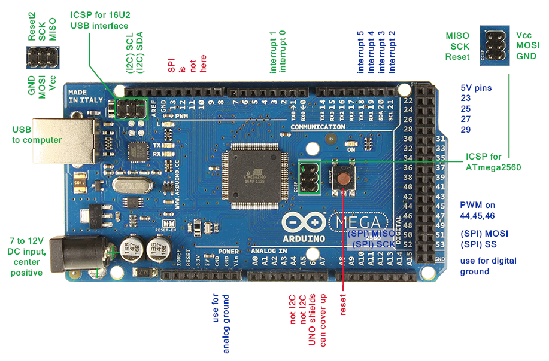
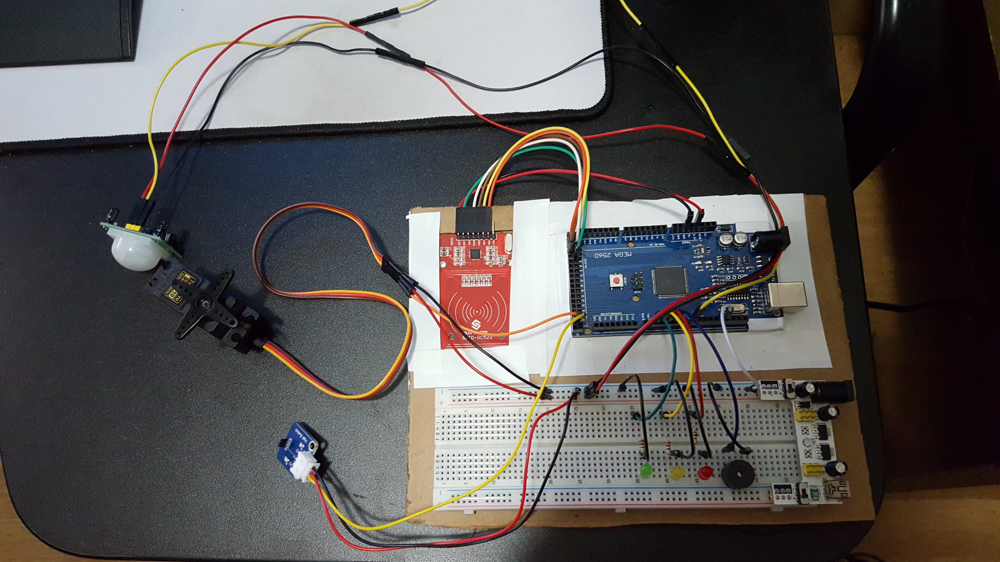
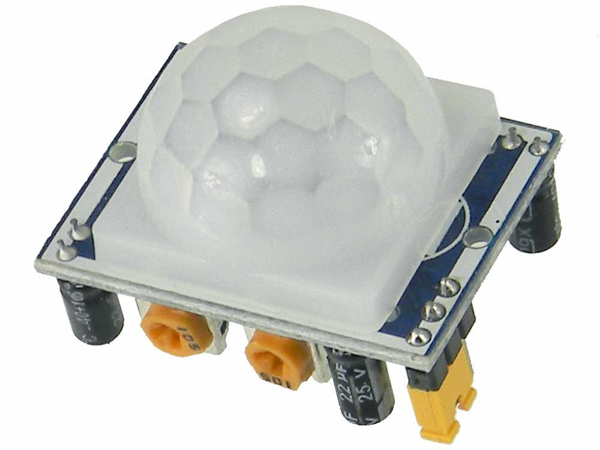

# Entry 5: Finishing up with the rfid door lock

I finally got my dedicated power supply and also got my Arduino Mega 2560 board.
All that's left for my rfid door lock is to transfer the hardware on the mega board and 
include my servo. I also decided to add a motion sensor to the door lock so that it opens 
when someone from the inside approaches the door. That way, I wouldn't have to manually unlock the door.

## Arduino Mega 2560

This is the beefed up version of the Arduino uno. There are many upgrades that the Mega provides, 
but for the purpose of my project, I will only benefit from these features:


1. The Uno only offers 13 digital pins while the Mega provides a whopping total of 54 digital pins. 
2. more 5v and ground ports for accessibility



## Servo motor

Unlike the regular motor, the servo has 3 pins. Two of the pins are the power and ground, 
while the last pin is PWM control. This last pin is what allows your program to control the position 
of the servo.

#### Code
The code for the servo is fairly straightforward. The library has to included like so: `#include <Servo.h>`.
After that, an object has to be created from the `Servo` class: `Servo object_name`. Now the communication has to be established. 
This can be achieve with a single line of code:`servo1.attach(digital_PWM_pin)`. 
Once the setup is done, all that's left is to control the position of the servo.
`object_name.write(degrees)` will allow precise angle control of the servo. 
Note that a servo motor can only **rotate up to 180 degrees**. 

Once the motor is done turning, you can cut off PWM signal to the motor using `object_name.detach()`. 
This offers 2 benefits:

1. Allow you to turn the motor by hand
2. Decrease power consumption as the motor requires energy to maintain the position it was signaled.
With that being said, the motor will resist an outside force turning the servo if it is not detached. 

## Passive infrared sensor (PIR)

The PIR (or motion sensor) uses 2 infrared rays to detect changes in temperature. 
When we come into the range of the motion sensor, we intercept the negative ray and send a positive 
signal from the positive ray. When we move, we intercept the opposite ray and send off the other signal. 
For the purpose of my project, I only need to detect the presence of a human, so I'll only need to look
for the negative signal. In the Arduino IDE, the negative signal is HIGH or 1. 

## Completed rfid door lock

I will install the door lock once I complete the lighting control portion of my project. 


```C
#include <SPI.h> //initialize the SPI library
#include <MFRC522.h> //initialize the RFID library
#include "RF24.h"  
#include <Servo.h> //initialize the servo library

const int green_LED = 2; 
const int yellow_LED = 3; 
const int red_LED = 4;
const int buzzer = 5;

const int motion = 8;                                                                                                             
const int hall = 22;
const int motor = 23;

const int reset = 48;
const int sda = 53; //data line

int mag; 
int unlock = 80;
int lock = 180;
int pid;
int door_status = 0; //0 is locked, 1 is open
byte uid[4]; //initialize uid variable with 4 elements

MFRC522 mfrc522(sda, reset);  //create MFRC522 instance with pin 48 as reset and pin 53 as SDA
Servo servo; //create Servo instance

void setup() {
  pinMode(green_LED, OUTPUT); 
  pinMode(red_LED, OUTPUT);
  pinMode(yellow_LED, OUTPUT);
  pinMode(buzzer,OUTPUT);
  pinMode(hall,INPUT); 
  pinMode(motion,INPUT); 
  
  Serial.begin(9600); //start serial communications at 9600 baud
  SPI.begin(); //start the SPI bus
  mfrc522.PCD_Init(); //start the MFRC522 rfid sensor
  servo.attach(motor);
  servo.write(lock); //reset door to LOCKED
  delay(1000); //give the servo 1 second to lock the door
  servo.detach(); //allow lock to be opened by key
  Serial.println("Ready. Door is locked.");
}

void loop() {
/***************MOTION***************/
pid = digitalRead(motion);  //0 = no motion, 1 = motion detected
if (pid == 1 && door_status == 0) { // 
    if (pid == 1) {
    Serial.println("Motion detected! Unlock the door!");
    servo.attach(motor);
    servo.write(unlock);
    digitalWrite(yellow_LED, HIGH);
    tone(buzzer,2000,300);
    door_status = 1;
    delay(5000); //5 seconds to open the door after someone is detected near the door  
    digitalWrite(yellow_LED, LOW);
    servo.detach(); 
    }
}

/***************HALL***************/
mag = digitalRead(hall); //0 = magnet detected, 1 = magnet not detected
if(mag == 0 && door_status == 1) { //if the magnet is detected and the door was locked for under 5 seconds
   Serial.println("Magnet detected! Door is locked!");
   tone(buzzer,500,300); 
   door_status = 0;
   servo.attach(motor); //send a PWM signal to the motor
   servo.write(lock); //turn clockwise 80 degrees (LOCK the door)
   delay(1000);
   servo.detach();   
}

/***************RFID***************/
if (mfrc522.PICC_IsNewCardPresent()) {
  mfrc522.PICC_ReadCardSerial();
  
  //store each byte (4 bytes in total) of scanned key into the array
  for (byte i = 0; i < 4; i++) {
    uid[i] = mfrc522.uid.uidByte[i];
    Serial.print(uid[i]); //print in decimal
    //Serial.print(String(uid[i], HEX)); //print in hex
    Serial.print(" ");
  }
  Serial.println();
  
  //keychain A1 id = 48 196 199 126
  //keychain A1 hex id = 30 c4 c7 7e
  
  //key matches
  if (uid[0] == 48 && uid[1] == 196 && uid[2] == 199 && uid[3] == 126){
    Serial.println("Match. Unlock the door!");
    servo.attach(motor); 
    servo.write(unlock); //turn counterclockwise 100 degrees (UNLOCK the door)
    digitalWrite(green_LED,HIGH);
    tone(buzzer,2000,300);
    door_status = 1; 
    delay(1000);
    servo.detach();
    digitalWrite(green_LED,LOW);
    delay(7000); //8 seconds to open the door after an authorized key is presented
  }
  //key doesn't match
  else {
    Serial.println("No match!");
    digitalWrite(red_LED,HIGH);
    tone(buzzer,500,300);
    delay(1000);
    digitalWrite(red_LED,LOW);
  }
}

/***************END***************/
}

```
## Next steps

Now that the first part is done, I am back to the planning board for the 2nd part. 
For my next step, I am planning to use a transceiver to signal another arduino board that will be installed on 
next to the light switch. When it is night time and someone comes home, the door lock will signal
the other board to turn on the light. To determine the time I will have 3 options:

1. use a photoresistor to measure the amount of daylight available
2. use a real time clock module
3. connect to the wifi and determine the time online

I glimpsed at the wifi portion of my project and it looks quite complicated. Since I have 3 weeks left, I am
planning to spend 2 weeks on the connecting my arduino to the web. Ideally, I will use the third option 
to determine the time as it is the most reliable and accurate. If I can't get it done, then I'll have to resort 
to the 2nd option. As for the following week, I will have to complete the the transceiver and the tft display sections. 


## Takeaway

#### Don't jump to conclusions
Troubleshooting can often be frustrating and will bring us to misleading conclusions. When first started with the motion sensor,
I thought that the sensor was defective as it gave me random return values. I searched up guides online and tried their examples, 
but none of them worked. Upon inspecting the sensor for physical damage, I discovered the orange potentiometers built into the board. 
I quickly searched up the purpose of the pots and realized that it was to adjust the sensitivity and timing of the sensor. 
After adjusting the sensitivity to medium and setting the timing to minimum, the sensor worked as I intended.  



## Sources
https://arduino-info.wikispaces.com/MegaQuickRef


