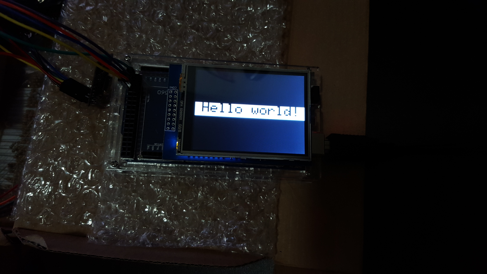

# Entry 6: Lighting control

The focus of this entry should've been the NRF24L01+ transceiver, 
but time is running low and so I had to squeeze in the TFT display as well. 
Anyways, the goal of this week is to receive a signal from the door lock when it is opened, and will turn on the lights
when it is night time. I still need to connect to the wifi to determine the time, but that will be in my next entry. 
For now, I won't need the standard servo since I could use the micro servo, which has identical code as its sibling.

## ILI9341 240 x 320 2.8 inch TFT (thin-film-transistor) LCD (liquid crystal display)
At first look, I was surprised by the quality of the display. Even at 240x320 resolution, 
the screen doesn't look pixelated at all. Also, the TFT LCD supports full rgb functionality, 
which includes about 16.8 million colors. Touch capability is also a nice feature that the TFT offers over a regular LCD.

#### Features
1. 16.8 million colors for each pixel
2. touch screen
3. SD card slot to display bitmap images
4. configured pins for easy installation (only the shield version)

#### Pin layout
Since I bought the version with the shield, all I had to do was plug it into the Arduino board.
Unfortunately, the version I have doesn't fully support the Arduino Mega. To address this issue,
I found a modified library that reassigns the pins. Now I can directly plug the TFT into the Arduino Mega.

#### Basic Functions
The code for the TFT is very similar to processing. The most basic functions to draw shapes are the following:
**c = color, r == radius**

1. drawLine(x,y,x1,y1,c) 
2. drawRect(x,y,l,w,c)
3. drawCircle(x,y,r,c)
4. drawTriangle(x,y,x1,y1,x2,y2,c)
5. drawRoundRect(x,y,w,l,r,c)

*Note that the shapes start drawing from the top left corner (except for the circle), 
defined by the x and y values. 

#### Hello world!


```cpp
#include <Adafruit_GFX.h>    // Core graphics library
#include <Adafruit_TFTLCD.h> // Hardware-specific library

#define LCD_RD A0 
#define LCD_WR A1 
#define LCD_CD A2 
#define LCD_CS A3 
#define LCD_RESET A4 

#define	BLACK   0x0000
#define	BLUE    0x001F
#define	RED     0xF800
#define	GREEN   0x07E0
#define CYAN    0x07FF
#define MAGENTA 0xF81F
#define YELLOW  0xFFE0
#define WHITE   0xFFFF

Adafruit_TFTLCD tft(LCD_CS, LCD_CD, LCD_WR, LCD_RD, LCD_RESET);

void setup() {
  Serial.begin(9600);
  Serial.println("ready");
  tft.reset();
  tft.begin(0x9341);
  tft.setRotation(1);
  tft.fillScreen(BLACK);
  tft.fillRect(0, 100, 320, 40, WHITE); //x,y,w,l
}

//ILI9341 240x320 2.8 inch
void loop() {
  tft.setCursor(20, 100);
  tft.setTextColor(BLACK);    
  tft.setTextSize(4);
  tft.println("Hello world!");
}
```

## NRF24L01+ transceiver
This low power radio transceiver is best for short range communication. 
For a basic communication between a server and a client, a pipe (channel) must be open. 
This is different from the actual channel, which a bandwidth measured in Hertz. 
The pipe is a user defined address that identifies the server/client. 

#### Pin layout
1. Ground - Black
2. 3.3v - Red
3. CE - orange (user defined)
4. CS(N) - yellow (user defined)
5. SCK - green (pin 52 or dedicated pin)
6. MOSI - blue (pin 51 or dedicated pin)
7. MISO - violet (pin 50 or dedicated pin)

*The color of the wire doesn't affect the functionality, but definitely makes the project more organized.

The NRF24L01+ transceiver requires 7 pins to function. Two of those pins (CE and CS) can be user defined in the Arduino IDE.
The last 3 pins offer less flexibility as they pre defined in the library for efficiency. 
They can still be changed, but the program would take longer to flash. 

#### Code for both the server and the client
```cpp
#include "RF24.h"
const int ce = 7; //orange
const int cs = 8; //yellow
RF24 light_radio (ce, cs); //create an instance with CE as pin 7 and CS as pin 8
byte addresses[][1] = {"test"} //name the pipe address as "test"
int data = 0;

void setup(){
  Serial.begin(115200); //the baud rate depends on the model of the transceiver
  delay(1000);
  light_radio.begin();  // Start up the nRF24L01 Radio
  light_radio.setChannel(108);  
  light_radio.setPALevel(RF24_PA_MIN); //reduce power usage to a minimum for efficiency and reliability
  light_radio.openReadingPipe(1, addresses[0]); //Start the "test" pipe. Note that the pipe names must be identical to establish a connection
  Serial.println("Ready");
}
```

#### Server (transmitter)
```
void setup(){
  door_radio.openWritingPipe(addresses[0]);
}

void loop(){
  
  door_radio.write( &data, sizeof(data) ); //  Transmit the data
  Serial.print("light status: ");
  light_switch += 1;
  delay(500);

}
```

#### Client (receiver)
```
void setup(){
  light_radio.startListening(); //begin receiving data  
}

void loop(){
  
  if ( light_radio.available()) { //check for incoming data from transmitter
    while (light_radio.available()){  //while there is data ready
      light_radio.read( &light_switch, sizeof(light_switch) ); //get the data payload 
    }
    Serial.print("light status: ");
    Serial.print(light_switch);
    Serial.println();
  }

}
```

## The button
In case there is a bug in my code, this button will override the code that is running and 
open the door/whatever I command it to do. For security purposes, I am considering about 
using this button to open the door from the inside instead of using a motion sensor. 

```cpp
int button = 2;
void setup() {
    Serial.begin(9600);
    pinMode(button, INPUT);
}

void loop() {
    int button_status = digitalRead(button);
  Serial.println(button_status); //1= button is pressed
  if (button_status == 1){
      //do something
  }
  delay(1);
}
```

## Takeaway


## Sources
http://www.whatimade.today/esp8266-easiest-way-to-program-so-far/
https://cdn-learn.adafruit.com/downloads/pdf/adafruit-gfx-graphics-library.pdf
https://arduino-info.wikispaces.com/Nrf24L01-2.4GHz-HowTo