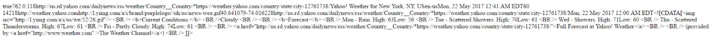
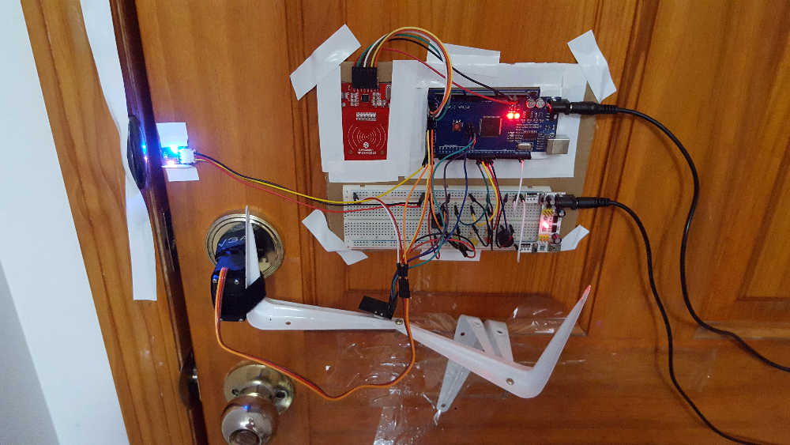
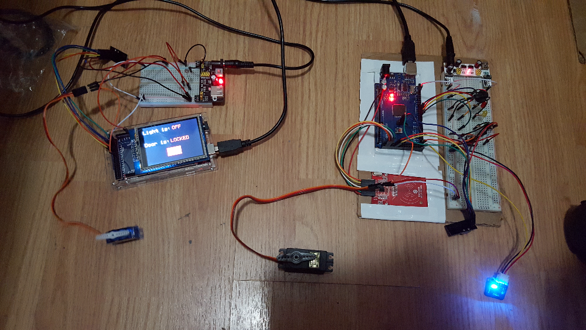

# Entry 8: Finishing touches

After connecting to the wifi, I need send a GET request to yahoo weather to retrieve the weather. 
Directly sending a request through an api would return a XML file, which contains a lot of unnecessary data. 

## Yahoo query language (YQL) and thingspeak
The YQL makes grabbing information from yahoo apis a lot easier and efficient. Thingspeak helps to filter out most of the unnecessary data. It also allows tracking of GET requests made. 

#### Steps
1. Create a yahoo account and register for api key
2. Go to **https://developer.yahoo.com/yql/console/#h=select+*+from+weather.forecast+where+woeid%3D2502265**
3. Update the woe id of the current location, which is 12761738.
4. Copy the YQL rest link at the bottom of the page. My link looks like this: 
https://query.yahooapis.com/v1/public/yql?q=select%20*%20from%20weather.forecast%20where%20woeid%3D2502265&diagnostics=true
5. Test it by going to the link on a web browser. 
6. Go to thingspeak.com and create an app.
7. Paste the YQL rest link into the URL section.
8. A GET request link should be generated. Follow the link and a similar result should be produced. 
Instead of a XML file, it should return something like this:




Then, it is time to connect to the link on the esp8266. 
```cpp
AT+CIPMODE=0 
AT+CIPMUX=1 //establish multiple connections
AT+CIPSTART=0,"TCP","query.yahooapis.com/",80 //connect the yahoo api at port 80
AT+CIPSEND=0,110 //send 110 bytes of information
GET https://query.yahooapis.com/v1/public/yql?q=select%20*%20from%20weather.forecast%20where%20woeid%3D2502265&diagnostics=true HTTP/1.1
```
<!--https://api.thingspeak.com/apps/thinghttp/send_request?api_key=GHMJY16ZJ5XHOMYC -->

Everything works fine until the GET request. The connection was successfully established but there was a 401 error saying that 
the connection is not authorized. The request works perfectly fine on my PC's browser, so I suspect there might be a problem with my commands.

## Putting everything together
Time is running low and I decided to wrap up everything that I have so far. When an authorized rfid card is presented, the door will unlock
and will notify the other arduino that the door has been unlocked. The TFT display will update the status and also check if it is dark. 
If so, the lights will turn on. Once the door is closed, it will automatically lock itself because it will detect the magnet. 

In addition, I created a button on the TFT that allows me to turn the lights on and off. There is also a button on the door lock, 
which opens the door.





RFID door lock from the outside: https://vimeo.com/218405945

RFID door lock from the inside: https://vimeo.com/218405958

RFID door lock + light switch: https://vimeo.com/218408005 

## Takeaway 

#### Always go for a modular design
When creating something, it is important to make the parts interchangeable and easily replaceable. 
For my project, the Arduino parts were already modular. However, when I was installing my rfid door lock, I realized that I should use velcro straps rather than tape for 
my servo. I can easily unwrap a velcro and reuse it. Tape, on the other hand, is sticky and non reusable. Also, I used shelf support brackets
instead of using pieces of wood to hold the servo into place. While I did sacrifice a bit of rigidity on the mechanism, 
I could easily pull back the bracket and remove the servo. I'm glad I made that choice because I ended up reinstalling the servo like 5 times. 


